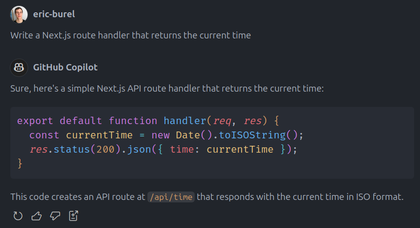

# Copilot RAG

Load external content to feed GitHub Copilot with relevant context.

LLM, despite being impressively knowledgeable, are language processing models and thus are meant to be fed with up-to-date text context to provide relevant suggestions.

For example, at the time of writing, ChatGPT won't write a proper Next.js App Router route handler and will stick to an older syntax.

Read the [RAG definition from IBM](https://research.ibm.com/blog/retrieval-augmented-generation-RAG) for more insights.

Copilot RAG aims at mimicking Cursor context loading features such as [@Docs](https://docs.cursor.com/context/@-symbols/@-docs).

> This extension is a very early prototype: it just downloads a URL locally and opens it in the editor.

Loading a web page is sadly usually not enough. Text must be parsed, so don't expect significant improvements with this early version.

Potential improvements:
- Parse HTML document to exclude irrelevant content
- Parse Shiki generated HTML that makes code difficult to consume
- Split content into chunks with Langchain utilities and add a query layer with SQLite to build a relevant context
- Accept an OpenAI API key to use embeddings for a proper semantic search
- Plug your own vector store
- Load GitHub documentation repositories containing markdown files
- Support well-known documentations that are not open-sourced such as Next.js documentation
- Integrate with GitHub Copilot more directly (this part doesn't depend on us)

## Features

Download a web page locally using the "Load a web URL" command.

## Extension Settings

None yet. This extension does NOT require any API key.

## Alternatives

## Release Notes

### 0.0.1

Initial release.